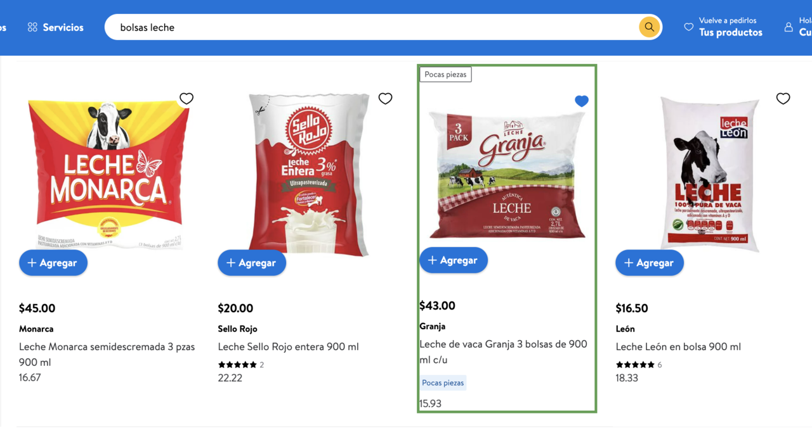

# Privacy Practices

## Justification for activeTab Permission:

The activeTab permission is essential for our extension as it allows us to access the content of the tab where the extension is activated. This access enables the extension to scan the product listing on the Walmart page the user is currently viewing, to calculate and display the best and worst price per unit directly to the user. This permission is used only when the user clicks on the extension icon, ensuring privacy and minimal permission usage.

## Justification for Host Permission Use:

We request host permissions for *.walmart.com to ensure that our extension can interact directly with Walmart’s website, where it extracts prices and unit details of listed items. This permission is critical to enable our extension to function specifically on Walmart product pages, thereby providing a seamless and efficient shopping experience by directly comparing unit prices.

## Justification for Remote Code Use:

Our extension does not use any remote code execution to ensure the highest standards of security and reliability. All scripts and functionalities are packaged within the extension itself, eliminating risks associated with remote code execution.

## Justification for Scripting:

Scripting permission is utilized by our extension to inject JavaScript into Walmart’s product pages. This is necessary to gather data about product prices and unit details, calculate the best and worst pricing per unit, and subsequently update the content of the web page to display this information to the user. Scripting is essential for the core functionality of our extension and is executed in a controlled manner to ensure it does not compromise the user's browsing experience or security.

## Single Purpose Description:

The primary purpose of our extension is to enhance online shopping efficiency by providing immediate comparisons of unit prices directly on the product pages of Walmart’s website. Upon clicking the extension icon, users can instantly see the best and worst unit prices for items they are viewing, helping them make more informed purchasing decisions. This focused functionality simplifies cost comparison, saving time and ensuring the best deals for the users.

Click on icon extension to initiate script

